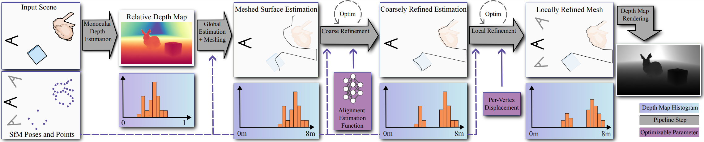

# Refinement of Monocular Depth Maps via Multi-View Differentiable Rendering

---

by Laura Fink, Linus Franke, Bernhard Egger, Joachim Keinert, and Marc Stamminger



Official repository   |   [Link to project page](https://lorafib.github.io/ref_depth/)   |   [My home page](https://lorafib.github.io/)

Abstract: 
Accurate depth estimation is at the core of many applications in computer graphics, vision, and robotics. 
Current state-of-the-art monocular depth estimators, trained on extensive datasets, generalize well but lack metric accuracy needed for many applications. 
In this paper, we combine the strength of those general monocular depth estimation techniques with multi-view data by framing this as an analysis-by-synthesis optimization problem to lift and refine such relative depth maps to accurate error-free depth maps. 
After an initial global scale estimation through structure-from-motion point clouds, we further refine the depth map through optimization enforcing multi-view consistency via photometric and geometric losses with differentiable rendering of the meshed depth map.
In a two-stage optimization, first scaling is further refined, and afterwards artifacts and errors in the depth map are corrected via nearby-view photometric supervision.
Our evaluation shows that our method is able to generate detailed, high-quality, metrically accurate depth maps, also in challenging indoor scenarios, and outperforms state-of-the-art multi-view depth reconstruction approaches on such datasets.


## Citation

```
@article{fink2024refdepth,
    title={Refinement of Monocular Depth Maps via Multi-View Differentiable Rendering},
    author={Laura Fink and Linus Franke and Bernhard Egger and Joachim Keinert and Marc Stamminger},
    journal={arXiv preprint arXiv:2410.03861},
    year = {2024}
}
```


---

## 📋 Prerequisites

Before you begin, make sure you have the following installed:

- [Miniconda or Anaconda](https://docs.conda.io/en/latest/miniconda.html)
- [CUDA Toolkit 12.1](https://developer.nvidia.com/cuda-12-1-0-download-archive) (Tested with 12.1) (or install locally in your environment see 3.)

---

## ⚙️ Setup Instructions

### 1. Clone the Repository (with Submodules)

```bash
git clone --recurse-submodules https://github.com/lorafib/ref_depth.git
cd ref_depth
```

or 

```bash
git clone https://github.com/lorafib/ref_depth.git
git submodule update --init --recursive
cd ref_depth
```

### 2. Create a Conda Environment

Create a new Conda environment (adjust version as needed):

```bash
conda create -n ref_depth python=3.11
conda activate ref_depth
```

### 3. Install Dependencies

Optional:
If you don't have a system-wide CUDA installation available, do

```
conda install -c nvidia/label/cuda-12.1.1 cuda cuda-toolkit
```

Then, install all required Python packages from `requirements.txt`:

```bash
git clone https://github.com/NVlabs/nvdiffrast
pip install -r requirements.txt
```

In case you have issues with versions, check out depth-refinement.yml for my (uncleaned) environment including version numbers.

---

## 🧪 Run Examples

### 1. Prepare data

Download and unzip the provided [example data](https://drive.google.com/file/d/1k0kBvJYUr70XFJIB54mZn88BW80ykxJu/view?usp=drive_link)


### 2. Run script

```bash

conda activate ref_depth

python refine_depth.py --config ./example_data/scannetpp_7831862f02/config_scannetpp.json
# or
python refine_depth.py --config ./example_data/Ignatius/config_tnt_ignatius.json
```


---

<!-- ## ⚠️ Notes

- This project is tested with **CUDA 12.1**; compatibility with other versions is not guaranteed.
- If you encounter issues related to CUDA or GPU drivers, refer to [NVIDIA’s troubleshooting guide](https://docs.nvidia.com/cuda/cuda-installation-guide-linux/index.html#troubleshooting). -->

---

## 📄 License

This project is licensed under the [Fraunhofer Research License](LICENSE).

---
